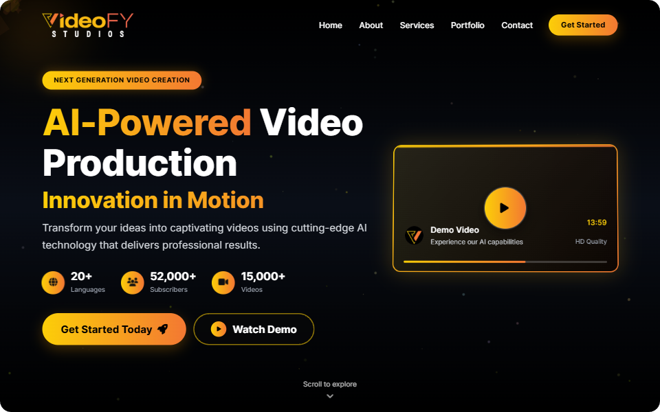
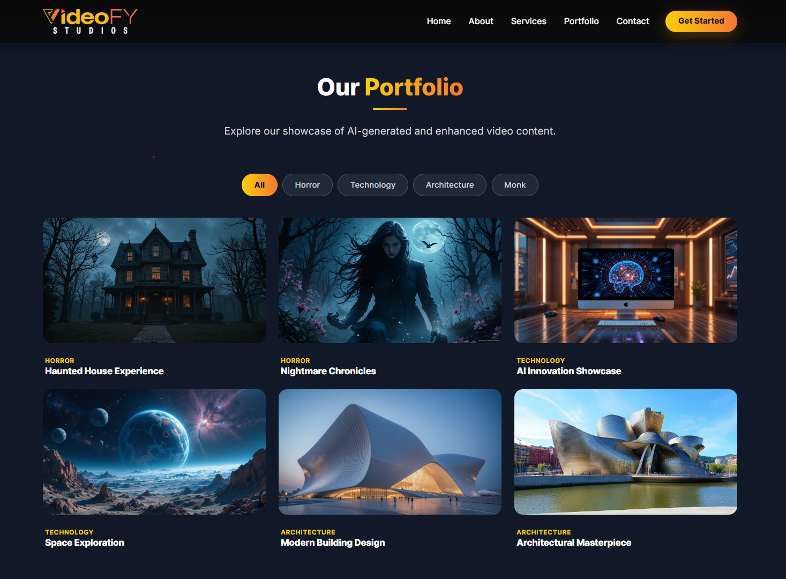
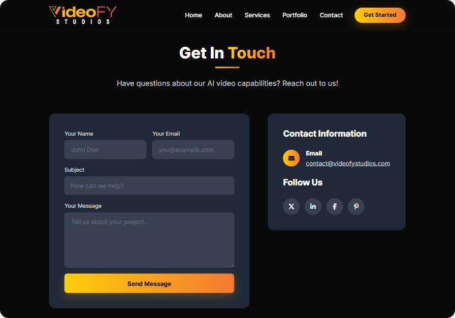
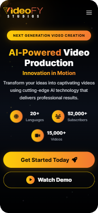

# Videofy Studios

A modern, responsive landing page for an AI-powered video production studio. Videofy Studios showcases AI video generation capabilities, automated editing, and content creation services through an interactive, visually engaging interface.

> **Project Status:** Active
> **License:** MIT



---

## Table of Contents

- [Features](#features)
- [Tech Stack](#tech-stack)
- [Project Structure](#project-structure)
- [Quick Start](#quick-start)
- [Development Notes](#development-notes)
- [License](#license)

---

## Features

### 🌟 Interactive Hero Section

- Animated particle background using HTML5 Canvas
- Mouse-tracking parallax effect on floating shapes and icons
- Animated statistical counters that trigger on scroll
- Integrated demo video card with a custom tilt effect


### 🎥 Dynamic Portfolio Gallery

- Video showcase categorized by genres (Horror, Technology, Architecture, Monk)
- Seamless filtering system with animated transitions
- YouTube video integration via a shared custom modal
- Playable video thumbnails with hover overlays



### ✉️ Interactive Contact Form

- Real-time client-side validation
- Accessible error feedback and success states
- Responsive layout adapting to mobile and desktop
- Graceful submission handling



### 📱 Mobile Responsiveness

- Flawless experience across all devices (desktops, tablets, and mobile phones)
- Offcanvas mobile menu for easy navigation on smaller screens
- Touch-friendly buttons, form fields, and modal interactions
- Fluid grid system that adapts perfectly to any screen size



### 🎨 UI, Animations, and Accessibility

- Responsive navigation bar with mobile offcanvas menu
- Progressive "reveal-on-scroll" animations using IntersectionObserver
- Support for `prefers-reduced-motion` to disable animations for accessibility
- Semantic HTML and ARIA labels for screen readers

---

## Tech Stack

| Layer | Technology |
|-------|------------|
| Frontend | HTML5, CSS3, Vanilla JavaScript |
| UI Framework | [Bootstrap 5](https://getbootstrap.com/) (Vendor asset) |
| Icons | [FontAwesome](https://fontawesome.com/) |
| Animations | CSS Transitions & Vanilla JS Canvas/IntersectionObserver |

---

## Project Structure

```text
Videofy Studios/
├── assets/                             # Vendor assets
│   └── vendor/
│       ├── bootstrap/                  # Bootstrap CSS & JS
│       └── fontawesome/                # FontAwesome icons
├── css/
│   └── style.css                       # Custom application styles
├── images/
│   ├── Category/                       # Portfolio thumbnail images
│   ├── favicon.png                     # Site favicon
│   └── logo.png                        # Brand logo
├── js/
│   └── script.js                       # Frontend behavior (animations, modals, form)
├── index.html                          # Main landing page
├── privacy.html                        # Privacy Policy page
├── terms.html                          # Terms of Service page
└── README.md
```

---

## Quick Start

### Prerequisites

No build tools or backend dependencies are required. A modern web browser is all you need.

### Installation

```bash
# Clone the repository
git clone https://github.com/tasmiul/videofy-studios-website.git
cd videofy-studios-website
```

### Running the Project

You can run the project in two ways:

1. **Directly in browser:** Simply double-click on `index.html` to open it in your default web browser.
2. **Local Development Server (Recommended):** To avoid any CORS issues with local files or to test properly, run a simple local server:

   ```bash
   # Using Python 3
   python -m http.server 8000
   ```
   
   Then open [http://127.0.0.1:8000/](http://127.0.0.1:8000/) in your browser.

---

## Development Notes

- **Animations:** All scroll animations and canvas effects check for `prefers-reduced-motion` to ensure accessibility standards are met.
- **Form Submission:** The contact form currently validates on the client side. To connect it to a backend, update the `CONTACT_ENDPOINT` variable in `js/script.js`.
- **Modals:** The site uses Bootstrap's modal component for video playback, injecting YouTube iframe sources dynamically to keep the initial page load light.

---

## License

This project is licensed under the MIT License.

```text
MIT License

Copyright (c) 2026 Tasmiul Alam Shopnil 

Permission is hereby granted, free of charge, to any person obtaining a copy
of this software and associated documentation files (the "Software"), to deal
in the Software without restriction, including without limitation the rights
to use, copy, modify, merge, publish, distribute, sublicense, and/or sell
copies of the Software, and to permit persons to whom the Software is
furnished to do so, subject to the following conditions:

The above copyright notice and this permission notice shall be included in all
copies or substantial portions of the Software.

THE SOFTWARE IS PROVIDED "AS IS", WITHOUT WARRANTY OF ANY KIND, EXPRESS OR
IMPLIED, INCLUDING BUT NOT LIMITED TO THE WARRANTIES OF MERCHANTABILITY,
FITNESS FOR A PARTICULAR PURPOSE AND NONINFRINGEMENT. IN NO EVENT SHALL THE
AUTHORS OR COPYRIGHT HOLDERS BE LIABLE FOR ANY CLAIM, DAMAGES OR OTHER
LIABILITY, WHETHER IN AN ACTION OF CONTRACT, TORT OR OTHERWISE, ARISING FROM,
OUT OF OR IN CONNECTION WITH THE SOFTWARE OR THE USE OR OTHER DEALINGS IN THE
SOFTWARE.
```

---

## Acknowledgments

- Design and development by Tasmiul Alam Shopnil
- Icons provided by [FontAwesome](https://fontawesome.com/)
- Modal and Grid systems powered by [Bootstrap](https://getbootstrap.com/)
